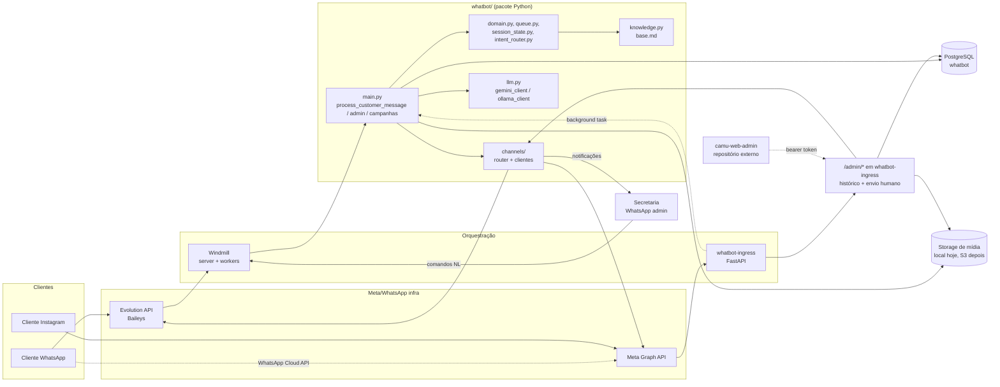

# Arquitetura do WhatBot

> Documento vivo — descreve o sistema como ele é hoje (commit `b299c8c`,
> 2026-08-05, após `conversation-history-media-storage`). Para o histórico
> de decisões e requisitos formais por capability, ver `openspec/specs/`;
> para o plano de cada mudança em andamento, `openspec/changes/`.

## 1. O que o sistema faz

WhatBot é um atendente automático para pequenos negócios. Ele recebe
mensagens de clientes pelo WhatsApp (e, opcionalmente, Instagram Direct),
responde com uma IA ancorada numa base de conhecimento local (arquivo
Markdown editável sem deploy), e transfere a conversa para um atendente
humano (handover) quando o cliente pede, quando o modelo decide que precisa,
ou quando o cliente faz um pedido pelo catálogo do WhatsApp. A secretaria
opera a fila de handover e outras tarefas administrativas por comandos em
linguagem natural, no próprio WhatsApp.

Não é um produto multi-tenant: cada instalação atende um negócio, configurado
via `.env` e `knowledge/base.md`.

## 2. Stack

| Camada | Tecnologia |
|---|---|
| Linguagem | Python 3.13, sem framework web para o núcleo (pacote único `whatbot/`) |
| Banco de dados | PostgreSQL 15, acesso via `psycopg` + `psycopg_pool` (`whatbot/db.py`) |
| LLM primário | Google Gemini via `google-genai` (`whatbot/gemini_client.py`), modelo padrão `gemini-2.5-flash` com fallback em cascata para `GEMINI_MODEL_FALLBACKS` |
| LLM alternativo | Ollama local (`whatbot/ollama_client.py`), sem custo de API — troca via `LLM_PROVIDER=ollama` |
| Fallback final | Resposta montada direto da base de conhecimento, sem LLM (`whatbot/fallback.py`), usada quando todo o resto falha |
| WhatsApp | Evolution API v2 (Baileys), container próprio, cliente HTTP em `whatbot/channels/whatsapp_evolution.py` |
| Instagram (opcional) | Meta Graph API (Instagram API with Instagram Login), cliente em `whatbot/channels/instagram.py` |
| Orquestração de produção | Windmill (self-hosted) — os jobs publicados em `windmill/f/whatbot/` são a porta de entrada real |
| Ingestão Instagram | Serviço HTTP dedicado `whatbot/ingress.py` (FastAPI + Uvicorn), fora do Windmill |
| Infra local | `docker-compose.yml` (perfis `windmill`, `bot`, `instagram`, `ollama`), `Makefile`, `run.ps1` |
| Testes | `unittest` da stdlib, sem `pytest`-fixtures nem `conftest.py`; `tests/fakes.py` centraliza os fakes (sem rede, sem Postgres real) |

Dependências Python (`requirements.txt`): `psycopg[binary]`, `psycopg_pool`,
`requests`, `google-genai`, `python-dotenv`, `fastapi`, `uvicorn[standard]`.

## 3. Visão geral dos componentes

Regra de camada (imposta e testada, ver `openspec/specs/channels/spec.md`):
**nenhum módulo de domínio (`main`, `domain`, `queue`, `admin`) segura um
cliente de canal concreto.** Todo envio passa por `ChannelRouter` ou pelos
helpers `send_admin` / `send_to_contact` (`whatbot/channels/router.py`).
Isso é o que permite o Instagram existir como canal adicional sem o núcleo
saber que ele existe.

## 4. Fluxos de dados

### 4.1 Mensagem de cliente — WhatsApp (fluxo síncrono via Windmill)

1. Cliente manda mensagem → Evolution API recebe e chama o webhook
   registrado (`scripts/register_windmill_webhook.py` configura isso).
2. Windmill executa `windmill/f/whatbot/handler.py`, que só repassa o
   payload para `whatbot.main.main(payload)`.
3. `main()`:
   - normaliza o payload (`normalize_payload`, aceita tanto o formato bruto
     da Evolution quanto o formato interno `{from_number, text, ...}`);
   - valida o canal na borda (`validate_channel` — rejeita canal
     desconhecido antes de tocar banco ou IA);
   - checa idempotência por `message_id` (`Database.record_webhook_event`)
     — reentrega do mesmo evento é descartada; se o processamento falhar
     depois do registro, o registro é desfeito para permitir reprocessar
     na próxima reentrega;
   - se o remetente é admin → vai para o fluxo de comandos administrativos
     (seção 6);
   - senão, `TEST_MODE`/`TEST_PHONES` decide se responde (fail-closed por
     canal — ver `openspec/specs/identity/spec.md`);
   - `process_customer_message()` é o coração do atendimento (seção 4.3).
4. Resposta sai por `ChannelRouter.send_text(canal=...)`, sempre no canal em
   que a mensagem chegou.

### 4.2 Mensagem de cliente — Instagram (fluxo assíncrono via `whatbot-ingress`)

1. Meta chama `POST /webhook/instagram` no serviço `whatbot-ingress`
   (container `whatbot_ingress`, perfil `instagram` do compose).
2. `whatbot/ingress.py` valida a assinatura HMAC-SHA256 (`X-Hub-Signature-256`,
   comparação em tempo constante) e devolve `200` **imediatamente** — a Meta
   reentrega se não receber confirmação rápida.
3. Só depois da resposta HTTP, um `BackgroundTasks` do FastAPI processa o(s)
   evento(s) do POST (pode vir mais de um) chamando o mesmo
   `whatbot.main.main(payload)` usado pelo WhatsApp — nenhuma lógica de
   domínio duplicada.
4. `whatbot/instagram_webhook.py` distingue mensagem real de: eco da própria
   secretaria (equivalente ao `fromMe` do WhatsApp), menção/resposta a
   story, mensagem só com mídia, notificação de mensagem apagada.
5. Envio de saída respeita a **janela de mensageria de 24h/7 dias** do
   Instagram (`whatbot/channels/base.py::MESSAGING_WINDOWS`,
   `whatbot/channels/instagram.py`): dentro de 24h desde o último
   `last_inbound_at`, envio normal; entre 24h e 7 dias, só com
   `human_agent=True` (atendimento humano); depois de 7 dias, recusado.
6. Renovação de credencial e alertas de saúde (streak de falhas de envio,
   silêncio de webhook) rodam por jobs agendados (`scripts/ig_refresh_token.py`,
   `windmill/f/whatbot/refresh_ig_token.py`, `whatbot/instagram_health.py`).

### 4.3 `process_customer_message()` — o núcleo do atendimento

Arquivo: `whatbot/main.py`. Passos, nessa ordem:

1. Roda checagens periódicas best-effort: notificação de espera prolongada
   na fila, reativação automática de contatos pausados por prazo.
2. Resolve/cria o contato (`Database.get_contact_by_phone`, chave
   `(canal, external_id)`), atualiza `push_name` e `last_inbound_at`.
3. Se `ia_ativa = FALSE` (em handover ou pausado manualmente por admin) →
   early return, mensagem só fica registrada, nada é gerado.
4. Se a mensagem é um **pedido do catálogo do WhatsApp** (`orderMessage`) ou
   contém um pedido explícito de atendimento humano → handover automático
   com prioridade máxima, incondicional (mesmo se os itens do pedido não
   forem identificáveis — nunca descarta o pedido).
5. Caso contrário: monta histórico recente (`trim_history_for_chat`), roteia
   a intenção da mensagem (`intent_router.route_intent` — preço, pagamento,
   entrega, pedido, horário...), atualiza `SessionState` (interesse por
   item, rastreado por turno) e o estágio de negócio do contato
   (`session_state.next_status`: `novo_lead → interessado → comprando`;
   `cliente_ativo` só é setado manualmente por admin).
6. Monta o system prompt (`prompt_builder.build_enriched_system_prompt`) com
   a base de conhecimento **completa** (nunca fatiada por intenção — decisão
   documentada em `openspec/specs/conversa/spec.md`) e chama o LLM.
7. Se o LLM falhar (quota, erro, indisponibilidade) → fallback em cascata:
   resposta offline montada da base de conhecimento
   (`fallback.build_knowledge_fallback`); se nem isso for possível, mensagem
   fixa de indisponibilidade ao cliente.
8. Se o LLM respondeu normalmente → `grounding.ensure_grounded_reply()`
   valida fatos citados (valores, números, nomes, dias da semana) contra a
   base e corrige/regenera se detectar alucinação — a correção acontece
   **depois** da geração, nunca substituindo a chamada ao modelo por um
   template fixo antes dela.
9. Se a resposta do modelo sinaliza necessidade de humano
   (`[HUMAN_HANDOVER]`) → handover.
10. Envia a resposta pelo canal de origem, registra mensagem de saída,
    persiste `session_state`, loga o turno completo
    (`message_log.log_llm_turn`) para auditoria.

### 4.4 Handover (fila de atendimento)

`whatbot/domain.py::executar_handover_para_secretaria`: desativa
`ia_ativa`, grava motivo/prioridade/timestamp, notifica a secretaria
(`whatbot/queue.py`) com um resumo do contato — nome/rótulo, canal,
prioridade, item de interesse ou itens do pedido do catálogo (com
quantidade quando > 1), e, em canais com janela de mensageria, o prazo
restante de resposta. A notificação é sempre entregue no canal de admin
(WhatsApp), qualquer que seja o canal de origem do cliente.

### 4.5 Jobs agendados (Windmill)

| Job (`windmill/f/whatbot/`) | Função Python | O que faz |
|---|---|---|
| `handler.py` | `whatbot.main.main` | Webhook síncrono do WhatsApp (evento por evento) |
| `check_queue.py` | `whatbot.main.check_queue` | Notificações de espera prolongada, reativação automática, resumo diário — recomendado a cada 5 min |
| `sync_catalog.py` | `whatbot.main.sync_catalog` | Atualiza `produtos_catalogo` a partir do catálogo real do WhatsApp Business |
| `import_campaign.py` | `whatbot.main.import_campaign` | Importa um CSV de disparo em massa (síncrono, chamado sob demanda) |
| `send_campaign_queue.py` | `whatbot.main.send_campaign_queue` | Drena `disparo_mensagens` pendentes, respeitando lote/intervalo/retries |
| `refresh_ig_token.py` | renovação de credencial Instagram | Renova o token antes de expirar, alerta se perto de expirar |

### 4.6 Histórico de conversas, mídia e API administrativa (`conversation-history-media-storage`)

Toda mensagem recebida via WhatsApp Cloud API passa a persistir mais do que
texto:

1. **Payload bruto.** `mensagens` ganhou `canal`, `message_id`, `payload`
   (JSONB, o evento cru do webhook) e `media_id` — todos opcionais, para não
   quebrar os call sites que não têm payload de canal (comandos internos de
   admin, por exemplo). Reentrega do mesmo `(canal, message_id)` é
   descartada por um índice único parcial, não duplica linha.
2. **Mídia (áudio, imagem, vídeo, documento, sticker).** Antes,
   `whatbot/whatsapp_cloud_webhook.py` classificava esse evento como
   `KIND_MEDIA_ONLY` e descartava tudo (`data=None`). Agora ele extrai a
   referência de mídia (`MediaRef`: tipo, id da Meta, mime type, legenda) e
   `whatbot/main.py::_handle_media_message`:
   - baixa o binário via `WhatsAppCloudClient.download_media` (dois passos
     da Graph API: metadados com URL assinada → binário);
   - grava o arquivo através de `whatbot/storage/` (`StorageBackend`
     Protocol; `LocalDiskStorage` é a única implementação hoje, endereçada
     por chave relativa como `whatsapp/2026/08/{contact_id}/{uuid}.ogg` —
     trocar para um backend em nuvem depois é reprocessar as mesmas chaves,
     não redesenhar o schema; configurável por `MEDIA_STORAGE_BACKEND`/
     `MEDIA_STORAGE_ROOT`);
   - registra a referência em `media_arquivos` (`status`: `baixado` |
     `pendente` | `falhou`) e a mensagem em `mensagens` (`media_id`), mesmo
     quando o download falha — a falha nunca derruba o processamento nem
     perde o registro de que o cliente mandou algo, só marca `status =
     'falhou'`/`erro` para reprocessamento manual depois.
   - Mensagem de mídia sem texto não passa pelo pipeline de LLM/intenção
     (nada a interpretar hoje) — só é persistida.
3. **API administrativa de leitura/envio.** `whatbot/ingress.py` (o mesmo
   serviço FastAPI do webhook do Instagram/WhatsApp Cloud) ganhou rotas
   `/admin/*`, autenticadas por bearer token estático (`ADMIN_API_TOKEN`,
   fail-closed se não configurado):
   - `GET /admin/conversas` — contatos com última mensagem/preview;
   - `GET /admin/conversas/{contact_id}/mensagens?before=&limit=` —
     histórico paginado por cursor (`Database.get_conversation`);
   - `GET /admin/midia/{media_id}` — stream do binário via `StorageBackend`
     (nunca um path de disco exposto);
   - `POST /admin/conversas/{contact_id}/mensagens` — envio como atendente
     humano, só aceito com o contato em handover (`ia_ativa = FALSE`),
     sempre via `ChannelRouter.send_to_contact` — nunca um client de canal
     concreto, mesma regra de layering do resto do projeto.

   Essa API existe porque o painel administrativo da empresa (estoque,
   vendas, precificação) vive num repositório externo,
   `Projeto-Aba-Reta/camu-web-admin` (Next.js/Supabase), com um Postgres
   **diferente** do WhatBot — a única forma de embutir uma tela de
   conversas ali é consumindo essa API do lado do servidor, nunca por
   leitura direta de tabela entre os dois bancos.

## 5. Módulos do pacote `whatbot/`

| Módulo | Responsabilidade |
|---|---|
| `main.py` | Entrypoints Windmill (`main`, `check_queue`, `sync_catalog`, `import_campaign`, `send_campaign_queue`) e o núcleo `process_customer_message` |
| `config.py` | Variáveis de ambiente, prompts de sistema por estágio, normalização de host Docker↔host, listas de teste por canal |
| `db.py` | `Database` — pool de conexões Postgres, `ensure_schema()`, todo o acesso a dados |
| `domain.py` | Regras de handover e detecção de intenção de atendimento humano |
| `session_state.py` | `SessionState` (memória de interesse por turno) e transição de estágio (`next_status`) |
| `intent_router.py` | Classificação de intenção da mensagem (preço, pagamento, entrega, pedido, horário) a partir de vocabulário curado |
| `knowledge.py` / `knowledge_facts.py` | Parser do `knowledge/base.md`, extração de fatos verificáveis para grounding |
| `prompt_builder.py` | Monta o system prompt final combinando estágio + base + intenção + resumo de histórico |
| `grounding.py` | Detecção de alucinação e correção pós-geração |
| `claim_validator.py` | Valida reivindicações factuais específicas citadas numa resposta |
| `fallback.py` | Resposta offline sem LLM, montada da base de conhecimento |
| `gemini_client.py` / `ollama_client.py` / `llm.py` | Clientes de LLM e fábrica (`create_llm_client`) que escolhe pelo `LLM_PROVIDER` |
| `tools.py` | Function calling do Gemini (`listar_itens`, `buscar_horarios_turmas`, `buscar_precos`, `buscar_info_negocio`, `buscar_faq`) quando `GEMINI_USE_TOOLS=true` |
| `webhook.py` | Parsers de payload da Evolution API (mensagens de entrada, mensagens de saída da secretaria, pedidos de catálogo) |
| `whatsapp_cloud_webhook.py` | Parser de payloads da WhatsApp Cloud API (mensagem de texto, status, mídia — extrai `MediaRef` em vez de descartar) |
| `instagram_webhook.py` | Parser de payloads do Instagram (mensagem, eco, story, mídia, apagada, múltiplos eventos) |
| `instagram_credentials.py` | Leitura/renovação de credencial Instagram (`canal_credenciais`) |
| `instagram_health.py` | Streak de falhas de envio e silêncio de webhook, alertas ao admin |
| `ingress.py` | Serviço FastAPI dedicado de ingestão dos webhooks Meta (Instagram e WhatsApp Cloud API) e das rotas `/admin/*` (histórico de conversas, mídia, envio humano) |
| `contact_resolver.py` | Resolução de contato por nome/telefone para comandos de admin, com desambiguação |
| `queue.py` | Notificações de fila (imediata, em lote, espera prolongada, resumo diário), auto-atendimento quando secretaria responde direto pelo WhatsApp |
| `admin.py` / `admin_nlu.py` | Comandos administrativos em linguagem natural e modo de simulação (`#simular`) |
| `message_log.py` | Log estruturado (JSONL) de entrada/saída/turnos de LLM, para auditoria e debug |
| `channels/base.py` | Contrato `ChannelClient`, `InboundMessage`, `ChannelError`, janelas de mensageria |
| `channels/router.py` | `ChannelRouter` — registro e resolução de cliente por canal, helpers `send_admin`/`send_to_contact` |
| `channels/whatsapp_evolution.py` | Cliente HTTP da Evolution API (WhatsApp), provider padrão (`WHATSAPP_PROVIDER=evolution`) |
| `channels/whatsapp_cloud.py` | Cliente da WhatsApp Cloud API oficial da Meta (`WHATSAPP_PROVIDER=cloud`) — envio de texto e `download_media` (baixa binário de mídia recebida) |
| `channels/instagram.py` | Cliente da Graph API do Instagram, aplica a janela de mensageria antes de enviar |
| `storage/base.py` | `StorageBackend` (Protocol) — contrato de armazenamento de mídia por chave relativa |
| `storage/local.py` | `LocalDiskStorage` — única implementação hoje, disco local, rejeita path traversal |
| `storage/factory.py` | `get_storage_backend()` — lê `MEDIA_STORAGE_BACKEND`/`MEDIA_STORAGE_ROOT`; `s3` reservado, ainda não implementado |

`scripts/` contém utilitários operacionais fora do fluxo de produção:
pareamento de WhatsApp (`pair_whatsapp.py`, `get_qrcode.py`), setup de
webhook (`setup_webhook.py`, `register_windmill_webhook.py`), OAuth e
manutenção do Instagram (`ig_oauth.py`, `ig_refresh_token.py`,
`ig_health_check.py`, `ig_subscribe_webhook.py`, `ig_simulate_webhook.py`),
health checks e diagnóstico (`health_check.py`, `test_auth.py`), e
manutenção de instância (`create_instance.py`, `recreate_instance.py`,
`delete_and_recreate.py`).

## 6. Comandos administrativos (secretaria, em linguagem natural)

Reconhecidos por `whatbot/admin_nlu.py::parse_admin_intent` (regex em
português, tolerante a variações), executados por `whatbot/admin.py`.
Qualquer número em `ADMIN_NOTIFY_PHONES` pode usá-los pelo WhatsApp:

| Intenção | Exemplos de frase | Efeito |
|---|---|---|
| `list_queue` | "fila", "quem tá esperando", "pendentes" | Lista contatos aguardando atendimento |
| `assume` | "assumir 5511999999999", "vou atender" | Marca o admin como responsável pelo contato |
| `complete` | "atendi", "finalizado", "resolvido" | Remove o contato da fila, reativa a IA |
| `complete_all` | "atender todos", "limpar a fila" | Encerra toda a fila de uma vez |
| `reactivate` | "reativar", "libera o bot", "pode voltar a falar" | Reativa a IA para um contato, mesmo pausado manualmente |
| `pause` | "pausa o bot para o João", "desativa o bot" | Pausa a IA indefinidamente para um contato específico (não reativa sozinha) |
| `mark_active_client` | "marca a Maria como cliente ativo" | Confirma manualmente `status = cliente_ativo` |
| `set_tipo_cliente` | "marca a Maria como empresa" / "como pessoa física" | Define `tipo_cliente` = `b2b`/`b2c` |
| `campaign_status` | "status do disparo LOTE", "quantos faltam no LOTE" | Progresso de um lote de disparo em massa |
| `summary` | "resumo", "estatísticas" | Resumo do dia |
| `help` | "ajuda", "?" | Lista de comandos |

Nome ambíguo (mais de um contato correspondendo) sempre dispara
desambiguação — pergunta qual contato antes de agir, nunca aplica no
contato errado.

### Modo de simulação (`#simular`)

Um admin pode testar o bot como se fosse cliente sem afetar dados reais:
`#simular` inicia uma sessão persistente (`admin_sessao`, uma linha por
admin), cada mensagem seguinte é tratada como se viesse de um cliente
fictício (`DEFAULT_TEST_PHONE`, nunca o número do próprio negócio —
`resolve_simulate_phone` troca automaticamente se colidirem), histórico e
`session_state` são mantidos só dentro da sessão de simulação (nunca tocam a
tabela de mensagens/contato real), e `#end-simular` encerra. Um comando de
disparo único (`#simular 5511... texto` ou uma pergunta "casual" de teste
rápido) também funciona sem entrar no modo persistente.

## 7. Campanhas de disparo em massa (CSV)

1. `import_campaign(csv_content, lote)`: valida linha a linha (`telefone` e
   `mensagem` obrigatórios, `tipo_cliente` opcional); uma linha inválida é
   reportada sem derrubar as demais; cada linha válida vira uma linha
   `pendente` em `disparo_mensagens`.
2. `send_campaign_queue()` (job agendado): drena até `CAMPAIGN_BATCH_SIZE`
   linhas por execução, pausa `CAMPAIGN_SEND_INTERVAL_SECONDS` entre envios,
   pula (`status = pulado`) contatos com `ia_ativa = FALSE` no momento do
   envio (handover em andamento ou pausa manual), tenta de novo até
   `CAMPAIGN_MAX_RETRIES` em falha retentável, marca `falha` imediatamente
   em erro não retentável.
3. `campaign_status` (comando de admin) consulta o progresso de um lote.

## 8. Catálogo de produtos (WhatsApp Business)

- `sync_catalog()` (job agendado) busca o catálogo real via
  `EvolutionApiClient.fetch_catalog()` e grava em `produtos_catalogo` — falha
  de rede/API não derruba o sistema, o cache local da última sincronização
  bem-sucedida é mantido.
- Um pedido feito pelo cliente através do catálogo do WhatsApp
  (`orderMessage`) é sempre capturado, mesmo quando o payload não traz
  `productId`/`retailerId` identificável (comum em iOS) — nesse caso o
  pedido ainda dispara handover com prioridade máxima, só que sinalizado
  como "itens não identificáveis" para o atendente confirmar com o cliente.
- `Database.resolve_catalog_items` resolve uma lista de ids para nome/preço
  a partir do cache local, sem chamada de rede síncrona durante o
  atendimento; ids desconhecidos são omitidos sem quebrar a resolução dos
  demais.

## 9. Identidade multicanal e segmentação de contatos

- Chave de identidade do contato: par `(canal, external_id)` — `external_id`
  é o telefone no WhatsApp e o IGSID no Instagram. `phone` continua
  existindo por compatibilidade, mas é `NULL` fora do WhatsApp.
- Rótulo legível de exibição (fila, notificações, logs): nome cadastrado →
  handle do canal → identidade externa crua, nessa ordem de precedência.
- `contatos.status` (estágio do funil): `novo_lead → interessado →
  comprando` transicionam automaticamente por sinal da conversa;
  `cliente_ativo` e `cancelado` exigem ação manual de admin.
- `contatos.tipo_cliente`: `b2c` (padrão) ou `b2b`, ajustável por comando de
  admin — não afeta o roteamento de intenção, só segmentação/relatório.

## 10. Modelo de dados (PostgreSQL)

Schema criado/migrado idempotentemente por `Database.ensure_schema()`
(`whatbot/db.py`) — sem ferramenta de migração externa, tudo
`CREATE TABLE IF NOT EXISTS` / `ALTER TABLE ADD COLUMN IF NOT EXISTS`.

| Tabela | Propósito |
|---|---|
| `contatos` | Um registro por cliente (ou admin). Chave `(canal, external_id)`. Campos: `status`, `tipo_cliente`, `ia_ativa`, `session_state` (JSONB), `push_name`, `handle`, `prioridade`, `handover_at`/`handover_motivo`/`atendido_at`/`assumido_por`, `bot_resume_at`, `last_inbound_at` |
| `mensagens` | Histórico de mensagens por contato (`direction` in/out). Também: `canal`, `message_id` (índice único parcial por canal, evita duplicar reentrega), `payload` (JSONB, evento bruto do webhook), `media_id` — todos opcionais |
| `media_arquivos` | Mídia recebida (áudio/imagem/vídeo/documento/sticker): `tipo`, `mime_type`, `tamanho_bytes`, `storage_backend`, `storage_key` (chave relativa, nunca path absoluto), `origem_media_id` (id da Meta), `status` (`baixado`\|`pendente`\|`falhou`), `erro` |
| `notificacao_admin` | Estado singleton do lote de notificações pendentes |
| `admin_sessao` | Sessão ativa de desambiguação/simulação por admin (`acao`, `candidatos` JSONB) |
| `handover_historico` | Registro de cada handover concluído (espera, prioridade, motivo, quem assumiu) |
| `resumo_diario_enviado` | Controle de idempotência do resumo diário (uma linha por dia) |
| `canal_credenciais` | Credencial de acesso por canal (hoje: Instagram — `access_token`, `expires_at`) |
| `webhook_eventos` | Idempotência de entrega de webhook por `(canal, message_id)` |
| `canal_envio_falhas` | Streak de falhas de envio consecutivas por canal, persistido entre execuções |
| `produtos_catalogo` | Cache local do catálogo do WhatsApp Business |
| `disparo_mensagens` | Fila de disparo em massa (campanhas CSV) |

## 11. Variáveis de ambiente

Ver `.env.example` para a lista completa e comentada. Grupos principais:

- **Banco/Evolution**: `DB_DSN`, `EVOLUTION_API_BASE_URL`, `EVOLUTION_API_KEY`,
  `EVOLUTION_API_INSTANCE_NAME`.
- **WhatsApp Cloud API** (`WHATSAPP_PROVIDER=cloud`): `WHATSAPP_PROVIDER`
  (`evolution`|`cloud`, default `evolution`), `WA_CLOUD_APP_SECRET`,
  `WA_CLOUD_WEBHOOK_VERIFY_TOKEN` (handshake/assinatura do webhook Meta,
  mesmo protocolo do Instagram); credencial (`access_token`,
  `phone_number_id`) vem de `canal_credenciais`, não de env var.
- **Histórico de conversas e mídia**: `MEDIA_STORAGE_BACKEND` (`local`,
  único implementado hoje), `MEDIA_STORAGE_ROOT` (default `./data/media`),
  `ADMIN_API_TOKEN` (bearer token das rotas `/admin/*` — sem ele, tudo é
  recusado com 401, fail-closed).
- **LLM**: `LLM_PROVIDER` (`gemini`|`ollama`), `GEMINI_API_KEY`,
  `GEMINI_MODEL`, `GEMINI_MODEL_FALLBACKS`, `GEMINI_TEMPERATURE`,
  `GEMINI_USE_TOOLS`, `OLLAMA_BASE_URL`, `OLLAMA_MODEL`.
- **Base de conhecimento**: `KNOWLEDGE_PATH`.
- **Admin/fila**: `ADMIN_NOTIFY_PHONES`, `NOTIFY_QUEUE_BATCH`,
  `NOTIFY_LONG_WAIT_MINUTES`, `NOTIFY_IMMEDIATE_ON_HANDOVER`,
  `NOTIFY_ON_ASSUMIR`, `AUTO_REACTIVATE_HOURS`, `DAILY_SUMMARY_HOUR`,
  `WHATBOT_TIMEZONE`, `BUSINESS_PHONE`.
- **Teste**: `TEST_MODE`, `TEST_PHONES`, `TEST_IGSIDS`, `DEFAULT_TEST_PHONE`.
- **Campanhas**: `CAMPAIGN_BATCH_SIZE`, `CAMPAIGN_MAX_RETRIES`,
  `CAMPAIGN_SEND_INTERVAL_SECONDS`.
- **Log de mensagens**: `WHATBOT_MESSAGE_LOG_PATH`,
  `WHATBOT_MESSAGE_LOG_MAX_CHARS`.
- **Instagram**: `IG_APP_ID`, `IG_CLIENT_SECRET`, `IG_APP_SECRET`,
  `IG_WEBHOOK_VERIFY_TOKEN`, `IG_OAUTH_REDIRECT_URI`, `IG_INGRESS_PORT`,
  `IG_INGRESS_URL`, `IG_ALERT_FAIL_STREAK`, `IG_ALERT_SILENCE_MINUTES`.

Qualquer variável essencial deixada em placeholder faz o app falhar no
startup com erro explícito (`config.is_placeholder`) — nunca falha
silenciosamente em produção.

## 12. APIs e endpoints HTTP expostos

| Endpoint | Serviço | Método | Propósito |
|---|---|---|---|
| `f/whatbot/handler` (Windmill) | `windmill-server` | Webhook (POST via Evolution) | Entrada de mensagens WhatsApp (`WHATSAPP_PROVIDER=evolution`, padrão) |
| `/webhook/instagram` | `whatbot-ingress` (porta `IG_INGRESS_PORT`, padrão 8090) | `GET` | Handshake de verificação da Meta |
| `/webhook/instagram` | `whatbot-ingress` | `POST` | Recebe eventos do Instagram (assinatura HMAC obrigatória) |
| `/webhook/whatsapp` | `whatbot-ingress` | `GET` | Handshake de verificação da Meta (WhatsApp Cloud API, `WHATSAPP_PROVIDER=cloud`) |
| `/webhook/whatsapp` | `whatbot-ingress` | `POST` | Recebe eventos da WhatsApp Cloud API — mensagem de texto e mídia (assinatura HMAC obrigatória) |
| `/admin/conversas` | `whatbot-ingress` | `GET` | Lista contatos com última mensagem/preview (bearer token) |
| `/admin/conversas/{contact_id}/mensagens` | `whatbot-ingress` | `GET` | Histórico paginado por cursor, com `payload` e mídia (bearer token) |
| `/admin/midia/{media_id}` | `whatbot-ingress` | `GET` | Stream do binário de uma mídia salva (bearer token) |
| `/admin/conversas/{contact_id}/mensagens` | `whatbot-ingress` | `POST` | Envio como atendente humano — só com o contato em handover (bearer token) |
| `/health` | `whatbot-ingress` | `GET` | Health check do serviço de ingestão |

APIs externas consumidas: Evolution API (`http://evolution-api:8080` dentro
do compose), Meta Graph API (Instagram e WhatsApp Cloud API, incluindo
download de mídia), Google Gemini API, Ollama local (opcional).

Consumidor externo da API `/admin/*`: painel administrativo da empresa
(`Projeto-Aba-Reta/camu-web-admin`, repositório separado, Next.js/Supabase)
— não vive neste repositório, chama a API do lado do servidor com o
`ADMIN_API_TOKEN`.

## 13. Infraestrutura (docker-compose)

| Serviço | Perfil | Porta | Papel |
|---|---|---|---|
| `db` | — | 5432 | Postgres do WhatBot |
| `evolution-db` | — | interno | Postgres da Evolution API |
| `redis` | — | 6379 | Cache/sessão da Evolution API |
| `evolution-api` | — | 8080 | Integração WhatsApp (Baileys) |
| `whatbot` | `bot` | — | Modo alternativo, roda `whatbot.main` em loop sem Windmill |
| `whatbot-ingress` | `instagram` | `IG_INGRESS_PORT` (8090) | Serviço FastAPI de ingestão do webhook do Instagram |
| `windmill-server` | `windmill` | 8000 | UI e API do Windmill |
| `windmill-worker` | `windmill` | — | Worker padrão, executa `whatbot.main()` |
| `windmill-worker-native` | `windmill` | — | Worker nativo (mais rápido para jobs Python simples) |
| `ollama` | `ollama` | 11434 | LLM local opcional |

Sem perfil, `docker compose up` sobe só a infra base (bancos, Redis,
Evolution API). `windmill` é necessário para o fluxo principal de produção;
`instagram` só é necessário se o canal Instagram estiver habilitado.

## 14. Testes

- `unittest` puro, descoberta via `python -m unittest discover -s tests -p
  'test_*.py'` (`make test`); `pytest -q` roda a mesma suíte.
- Nenhum teste unitário toca rede ou Postgres real — fakes centralizados em
  `tests/fakes.py`. Exceções documentadas por change quando o teste precisa
  validar contra infraestrutura real (ex.: migração de schema, em
  `tests/integration/`).
- Teste end-to-end único e canônico: `tests/test_main_e2e.py`, entrando por
  `whatbot.main.main()` — a mesma porta que o handler do Windmill chama em
  produção. Qualquer mudança no ciclo contato → identidade → conhecimento →
  resposta deve estender esse arquivo, nunca duplicá-lo.
- ~35 arquivos de teste cobrindo: fluxo principal, admin/simulação, canais
  (contratos, roteador, WhatsApp, Instagram), campanhas, catálogo, grounding,
  fila, sessão, webhook (WhatsApp e Instagram), knowledge base.

## 15. Planejamento (OpenSpec)

O projeto usa OpenSpec (`openspec/`) como fonte de verdade do planejamento.
`openspec/specs/` tem uma capability por área (`admin`, `campaigns`,
`catalog`, `channels`, `contacts`, `conversa`, `identity`, `instagram`) com
requisitos formais e cenários — a origem de boa parte deste documento.
`openspec/changes/` tem mudanças em andamento; `openspec/changes/archive/`
tem o histórico do que já foi implementado. Ver `openspec/project.md` para
convenções do repositório e ordem de dependência entre changes ativos —
hoje, a fatia de Instagram ainda em aberto é `instagram-go-live` (homologação
formal) e `instagram-operability` (runbook), ambas adiadas até
`instagram-live-smoke-test` validar a integração real.

## 16. Documentos relacionados

- [`README.md`](../README.md) — quick start e comandos do dia a dia.
- [`DEPLOYMENT.md`](../DEPLOYMENT.md) — pareamento do WhatsApp e
  troubleshooting da Evolution API.
- [`WHATBOT-DOCKER-DAEMON.md`](../WHATBOT-DOCKER-DAEMON.md) — rodar o stack
  em background no Linux.
- [`windmill/README.md`](../windmill/README.md) — setup passo a passo do
  Windmill e do webhook.
- [`knowledge/README.md`](../knowledge/README.md) — formato do arquivo de
  base de conhecimento.
- [`docs/INSTAGRAM_INTEGRATION_PLAN.md`](INSTAGRAM_INTEGRATION_PLAN.md) —
  plano narrativo completo da integração com Instagram.
- [`docs/REVISAO_CAMADA_CONVERSACIONAL.md`](REVISAO_CAMADA_CONVERSACIONAL.md)
  — revisão histórica da camada de conversa (origem de várias regras da
  seção 4.3).
